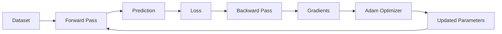

<div align="center">

# 🧠 Neural Network From Scratch

### *Building Deep Learning One Matrix Multiplication at a Time*

<p>
A fully connected neural network implemented entirely from <b>first principles</b> using only <b>NumPy</b>.
<br>
No TensorFlow. No PyTorch. No Keras.
<br>
Just mathematics, matrix operations, and backpropagation.
</p>

<br>


<br><br>

> **A complete educational implementation of a neural network that exposes every mathematical operation behind modern deep learning.**

---

### ⭐ Why This Project?

Instead of hiding neural network internals behind high-level APIs, this project exposes every computational step, allowing you to understand exactly how learning happens.

Perfect for:

🎓 Students learning Deep Learning

🧠 Machine Learning Enthusiasts

💼 Interview Preparation

🔬 Research Foundations

🚀 AI Engineers wanting to master the fundamentals

</div>

---

# 📖 Overview

Modern deep learning libraries abstract away the mathematics that powers neural networks.

Although this dramatically simplifies model development, it also makes it difficult to understand what actually happens during training.

This repository rebuilds an entire feed-forward neural network **from scratch**, implementing every stage manually using only NumPy.

Instead of calling framework functions, every computation—from forward propagation to gradient descent—is written explicitly.

The result is a clean educational codebase that demonstrates exactly how neural networks learn.

---

# ✨ Highlights

<table>
<tr>
<td width="50%">

### 🧮 Mathematical Foundation

* Matrix-based computation
* Chain Rule implementation
* Gradient calculation
* Weight optimization
* Loss minimization
* Numerical stability

</td>

<td width="50%">

### ⚙ Engineering

* Modular architecture
* Reusable layers
* Configurable models
* Training pipeline
* Model persistence
* Experiment management

</td>
</tr>
</table>

---

# 🎯 What You'll Learn

Instead of simply **using** neural networks, you'll understand **how they work internally.**

| Concept              | Implemented |
| -------------------- | ----------- |
| Forward Propagation  | ✅           |
| Dense Layers         | ✅           |
| Activation Functions | ✅           |
| Loss Computation     | ✅           |
| Backpropagation      | ✅           |
| Gradient Descent     | ✅           |
| Adam Optimizer       | ✅           |
| Weight Updates       | ✅           |
| Model Evaluation     | ✅           |
| Model Serialization  | ✅           |

---

# 🏗 Architecture

```text
                Input Layer
                     │
                     ▼
          ┌────────────────────┐
          │   Dense Layer      │
          └────────────────────┘
                     │
                     ▼
          ┌────────────────────┐
          │ Activation Layer   │
          └────────────────────┘
                     │
                     ▼
          ┌────────────────────┐
          │   Dense Layer      │
          └────────────────────┘
                     │
                     ▼
          ┌────────────────────┐
          │ Activation Layer   │
          └────────────────────┘
                     │
                     ▼
              Output Layer
                     │
                     ▼
             Loss Calculation
                     │
                     ▼
             Backpropagation
                     │
                     ▼
             Adam Optimizer
                     │
                     ▼
             Updated Weights
```

---

# 🚀 Features

## Core Neural Network

* Fully connected dense layers
* Configurable architectures
* Multiple hidden layers
* Matrix-based computation
* Bias handling
* Weight initialization

---

## Activation Functions

* ReLU
* Sigmoid
* Softmax
* Identity

---

## Training Engine

* Manual forward propagation
* Manual backward propagation
* Batch processing
* Epoch-based training
* Validation evaluation
* Training history tracking

---

## Optimization

* Adam Optimizer
* Gradient computation
* Learning rate control
* Parameter updates

---

## Utilities

* Model checkpointing
* Best model selection
* Pickle serialization
* Experiment runner
* Performance tracking

---

# 🧩 Project Structure

```text
NeuralNetworkfromscratch
│
├── layers/
│   ├── dense.py
│   ├── activations.py
│   └── layer.py
│
├── optimizers/
│   └── adam.py
│
├── models/
│   └── neural_network.py
│
├── utils/
│   ├── metrics.py
│   ├── trainer.py
│   ├── dataset.py
│   └── serialization.py
│
├── experiments/
│   └── runner.py
│
├── saved_models/
│   └── best_model.pkl
│
├── main.py
│
├── requirements.txt
│
└── README.md
```

---

# ⚡ Installation

## Clone Repository

```bash
git clone https://github.com/VasuML07/NeuralNetworkfromscratch
```

---

## Navigate

```bash
cd NeuralNetworkfromscratch
```

---

## Install Dependencies

```bash
pip install numpy
```

---

# ▶ Running

```bash
python main.py
```

---

# 🔄 Training Pipeline

```text
Dataset
   │
   ▼
Weight Initialization
   │
   ▼
Forward Propagation
   │
   ▼
Prediction
   │
   ▼
Loss Calculation
   │
   ▼
Backpropagation
   │
   ▼
Gradient Computation
   │
   ▼
Adam Optimization
   │
   ▼
Weight Update
   │
   ▼
Repeat Until Convergence
```

---

# 📊 Learning Workflow



---

# 🛠 Technology Stack

| Category             | Technology              |
| -------------------- | ----------------------- |
| Programming Language | Python                  |
| Numerical Computing  | NumPy                   |
| Serialization        | Pickle                  |
| Deep Learning        | Built From Scratch      |
| Linear Algebra       | NumPy Matrix Operations |

---

# 📈 Training Components

| Module          | Purpose                |
| --------------- | ---------------------- |
| Dense Layer     | Linear Transformation  |
| Activation      | Non-Linearity          |
| Loss Function   | Error Measurement      |
| Backpropagation | Gradient Computation   |
| Adam            | Parameter Optimization |
| Trainer         | Model Learning         |
| Evaluator       | Performance Assessment |

---

# 🧠 Mathematical Pipeline

```text
Input

↓

Linear Transformation

↓

Activation

↓

Prediction

↓

Loss

↓

Gradient

↓

Weight Update

↓

Repeat
```

---

# 🎓 Educational Value

This repository demonstrates how modern deep learning libraries work internally.

By reading and experimenting with this implementation, you'll gain practical understanding of:

* Linear Algebra in Deep Learning
* Matrix Multiplication
* Gradient Descent
* Chain Rule
* Neural Network Optimization
* Adam Optimizer
* Model Training
* Prediction Pipelines
* Parameter Updates
* Software Design for Machine Learning

---

# 📂 Model Persistence

The best-performing model is automatically stored as:

```text
saved_models/
└── best_model.pkl
```

This enables:

* Model reuse
* Inference
* Experiment comparison
* Reproducibility

---

# 📌 Example Workflow

```text
Initialize Model

↓

Load Dataset

↓

Train

↓

Validate

↓

Save Best Model

↓

Inference
```

---

# 🚀 Future Improvements

* Dropout Layers
* Batch Normalization
* Convolutional Neural Networks
* Recurrent Neural Networks
* GPU Acceleration
* Automatic Differentiation
* Learning Rate Scheduling
* Early Stopping
* TensorBoard-style Visualization
* Additional Optimizers

---

# 🤝 Contributing

Contributions are welcome.

You can help by:

* Adding new activation functions
* Improving optimization algorithms
* Refactoring code
* Writing tests
* Enhancing documentation
* Adding educational examples

---

# 📜 License

This project is released under the **MIT License**.

Feel free to use, modify, and build upon it for educational and research purposes.

---

<div align="center">

## ⭐ If you found this project useful...

Give the repository a **Star** to support future open-source work.

### Built to understand Deep Learning — not just use it.

**Made with Python + NumPy**

</div>
