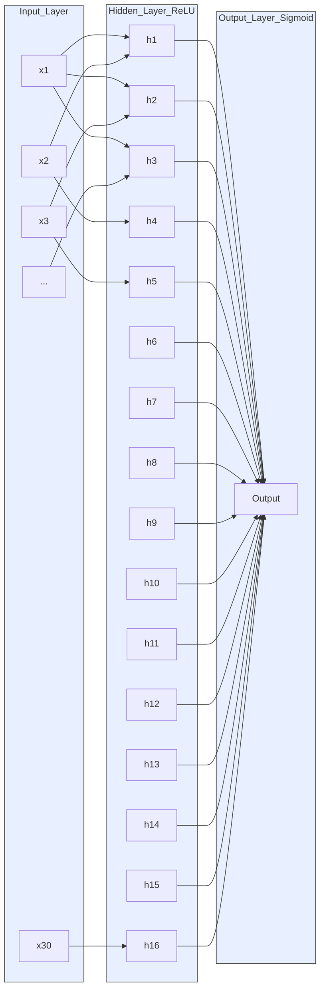

# Neural Network Breast Cancer Classifier

## Model Architecture

```mermaid
flowchart LR

subgraph Input_Layer
X1[x1]
X2[x2]
X3[x3]
X4[...]
X30[x30]
end

subgraph Hidden_Layer_ReLU
H1[h1]
H2[h2]
H3[h3]
H4[h4]
H5[h5]
H6[h6]
H7[h7]
H8[h8]
H9[h9]
H10[h10]
H11[h11]
H12[h12]
H13[h13]
H14[h14]
H15[h15]
H16[h16]
end

subgraph Output_Layer_Sigmoid
O1[Output]
end

X1 --> H1
X1 --> H2
X1 --> H3
X2 --> H1
X2 --> H4
X3 --> H2
X3 --> H5
X4 --> H3
X30 --> H16

H1 --> O1
H2 --> O1
H3 --> O1
H4 --> O1
H5 --> O1
H6 --> O1
H7 --> O1
H8 --> O1
H9 --> O1
H10 --> O1
H11 --> O1
H12 --> O1
H13 --> O1
H14 --> O1
H15 --> O1
H16 --> O1

Input_Layer:::layer
Hidden_Layer_ReLU:::layer
Output_Layer_Sigmoid:::layer

classDef layer fill:#e8f0ff,stroke:#333,stroke-width:1px;
```
